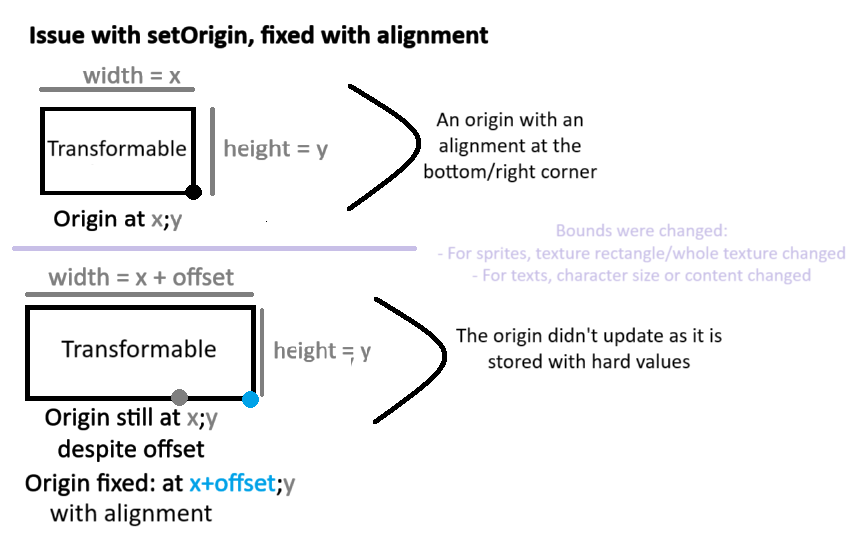
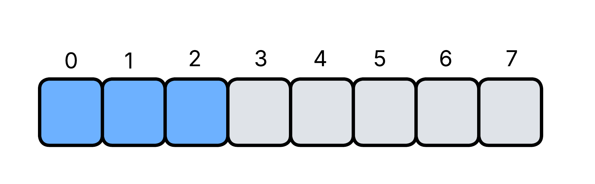
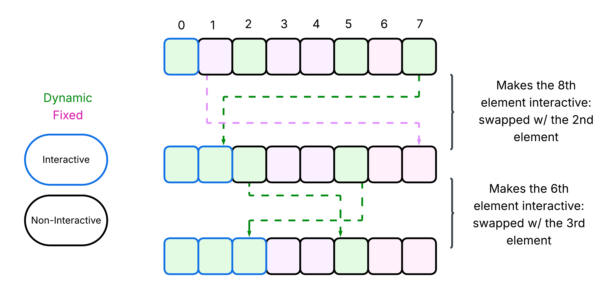
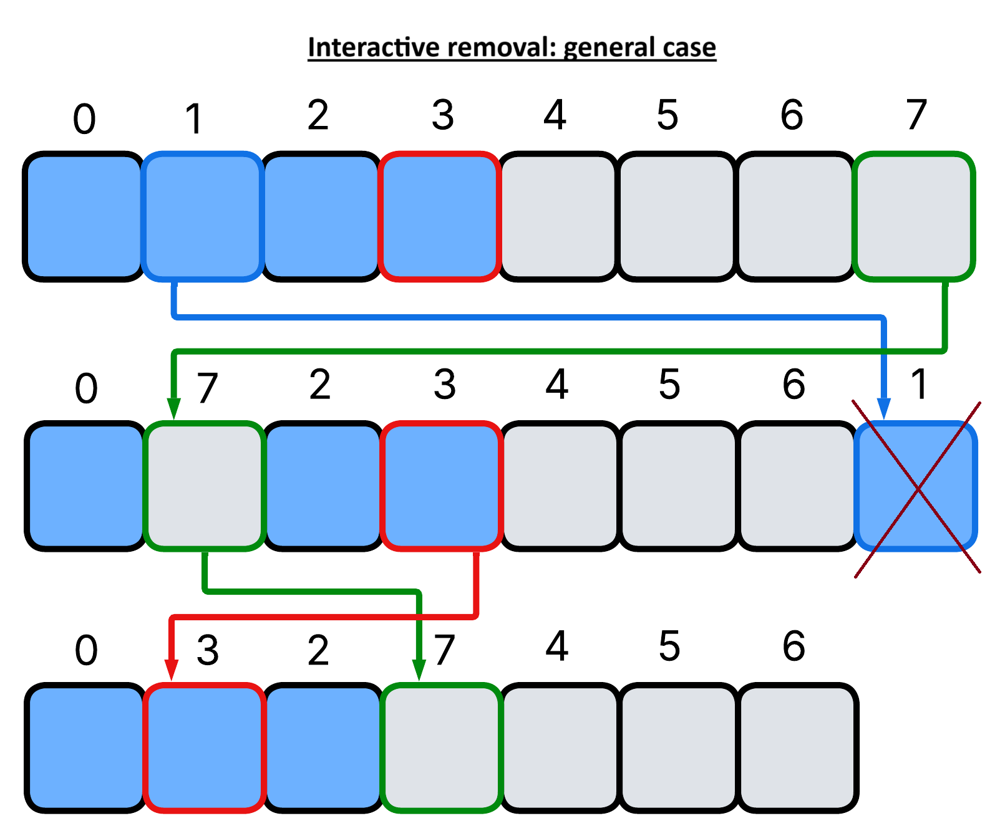
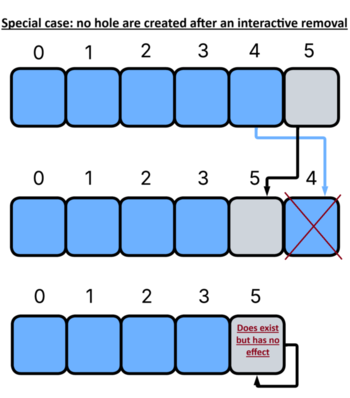
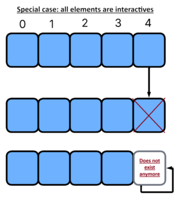
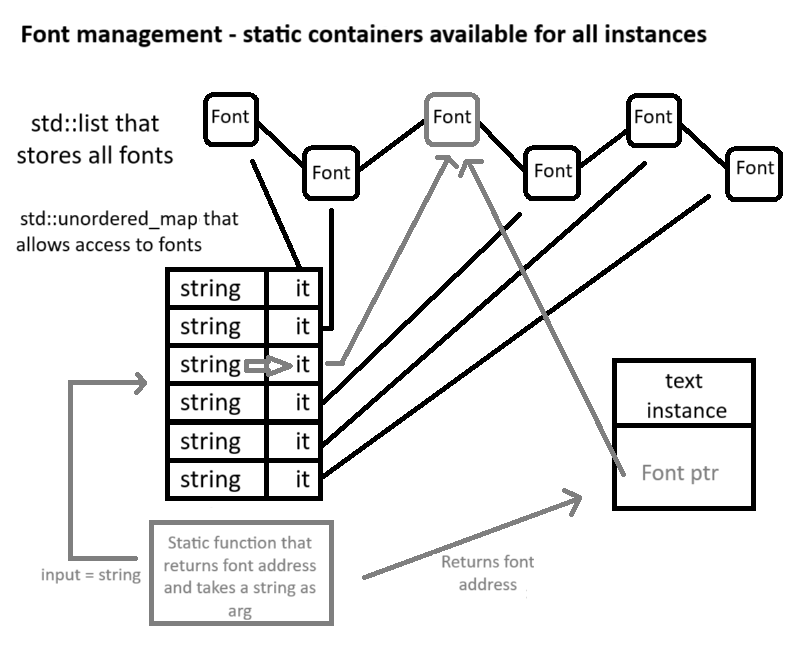
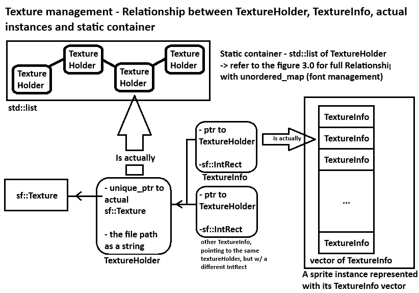

Note before reading: please make sure you understand read the readme so you are at least a bit familiar.<br>
"Element" refers to Sprite+Text, just like in the readme<br>
All sections are independant, you can go to the one you want:<br>
- Hash table
- Alignment
- Removal in O(1).
- Interactives
- Texture and Font management

---------------------------------------------------------------------------------------------------<br>
**Hash table**:<br>
All dynamic GUI elements are accessed through string identifiers. Because of that, we need a hash table that efficiently converts these strings into keys. Our goals are simple:<br>
- Avoid collisions as much as possible so lookups stay effectively O(1) — this is the priority.
- Keep the hash function fast, since it will run all the time.

We can safely assume the following:<br>
*Assumption #1* — Identifiers are human-readable.<br>
They will mostly contain letters, words, and numbers → So the hash function should perform well on such strings.<br>

A strong candidate is wyHash64, a very fast and well-designed hash you can find here: https://github.com/wangyi-fudan/wyhash<br>
---------------------------------------------------------------------------------------------------<br>
**Alignment**:<br>
The Alignment enum exists to solve a long-standing issue with setOrigin in SFML.<br>
In SFML, the origin is always defined in *fixed local* coordinates.<br>

Example:<br>
A sprite is 20×40 and positioned at (200, 200). To center the origin, you must give the local coordinates (10, 20) — the sprite’s center relative to its own bounds. The global position is irrelevant here.
This local system is fine… until the object is resized. SFML stores the literal numbers (10, 20). It does not store the fact that the origin was “the center of the sprite”. If the sprite grows or shrinks, 10×20 is no longer the center.<br>

That’s the exact problem the Alignment enum fixes.<br>

Your TransformableWrapper intercepts calls to SFML’s transformable functions. Whenever the size changes, it recomputes the origin based on the stored Alignment value (given at construction, but modifiable later). This guarantees that “center”, “top-right”, etc., remain semantically correct even after resizing.<br>
<br>

The alignment has nine possible values, arranged like a 3×3 grid:<br>
- Left / Center / Right
- Top / Center / Bottom

To encode them compactly, the enum splits into two components:<br>
- Vertical alignment (top, middle, bottom) → stored in the two least significant bits.
- Horizontal alignment (left, center, right) → stored in the next two bits.

Two bits give four possible states, and we only need three, so one combination is unused.<br>
You combine horizontal and vertical parts with a bitwise OR (operator|). TransformableWrapper then decodes this value to compute the corresponding origin when the size changes.<br>

(Note: TransformableWrapper contains an sf::Transformable rather than inheriting from it, to avoid virtual-function overhead.)<br>
```
constexpr inline Alignment operator|(Alignment lhs, Alignment rhs) noexcept
{
	int8_t newAlignment{ static_cast<uint8_t>(lhs) | static_cast<uint8_t>(rhs) };

	// Checking if alignment are not compatible.
	if (((newAlignment & 0b00000011) == 0b00000011)
		|| ((newAlignment & 0b00001100) == 0b00001100))
		return lhs;

	return static_cast<Alignment>(newAlignment);
}

constexpr sf::Vector2f computeNewOrigin(sf::FloatRect bound, Alignment alignment) noexcept
{
	sf::Vector2f originTopLeft{ 0, 0 };
	sf::Vector2f originBottomRight{ bound.size };
	sf::Vector2f origin{ bound.getCenter() }; // Center origin by default.

	uint8_t value = static_cast<uint8_t>(alignment);
	if ((value >> 3) & 1)
		origin.x = originTopLeft.x; // Left side.
	else if ((value >> 2) & 1)
		origin.x = originBottomRight.x; // Right side.

	if ((value >> 1) & 1)
		origin.y = originTopLeft.y; // Top side.
	else if ((value >> 0) & 1)
		origin.y = originBottomRight.y; // Bottom side.

	return origin;
}
```
---------------------------------------------------------------------------------------------------<br>
**Removal in O(1)**:<br>
Removing an element from a dynamic array (std::vector) is usually O(n) because all subsequent elements must shift down to fill the gap.<br>
However, if the order of elements is not important, we can achieve O(1) removal by swapping the element to be removed with the last element and then popping the last element off the vector.<br>
This technique avoids shifting elements and keeps the removal operation constant time.<br>
---------------------------------------------------------------------------------------------------<br>
**Interactives**<br>
Interactives are dynamic GUI elements the user can interact with. The simplest and most reliable way to detect them is to check whether the mouse is hovering over them. But this means the cost scales linearly with the number of interactives: O(N) per hover check.<br>
There is a theoretical alternative: using an associative container (hash table) keyed by the positions of interactive elements, and hashing the mouse position. In theory, this could give an amortized O(1) lookup. In practice, it's not usable because interactive elements are dynamic: their size, position, or internal state can change at any time.<br>

A currently hovered element may stop being hovered simply because:<br>
- the mouse moved, or
- the element itself moved.

Since both events can happen frequently, we would need to update or rehash the structure constantly → This is a frequent operation.<br>

*Assumption #2*: Mouse movement is usually far more frequent than object movement.<br>
→ So the hover logic should be tightly tied to SFML’s mouse-move events, and the cost of updating an element after it moves should be negligible.<br>
This assumption holds in most situations, but not all — so the API must still behave correctly in edge cases.<br>

Why Cache Locality Matters Here:<br>
Hover detection runs very often. At this point, micro-optimizations matter more than big-O complexity. To keep things fast, we want all interactives packed tightly in memory → continuous storage. We’re already storing all elements in a single std::vector, mainly for cache locality during drawing. We can take advantage of that same vector for hover detection. The question is: *how do we know which of these elements are interactives?* An associative container mapping each item to an “interactive” flag is a bad idea: it destroys spatial and temporal locality (lots of pointer chasing). A second vector listing only interactives is also bad: it adds another lookup and breaks locality.<br>

But there’s a clean trick:<br>
Store all interactives at the beginning of the vector. We partition the vector into two contiguous segments: <br>
- Interactive elements (front of the vector, densely packed)
- Non-interactive elements (everything else)

This way:<br>
- Hover detection only iterates over the first segment.
- We scan a compact memory region.
- Cache locality is preserved.
- Complexity remains O(N_interactives), which is usually a small subset

In blue are the interactives<br>
<br>

Below is the code portion that actually checks hovered. ```m_nbOfButtonSprites``` is the number of interactive sprites. The good thing is that the code is actually short, clean and simple: this can help *some compilers*  to enable SIMD, yet another optimization. You can notice the unlikely attribute: that is because, as more elements are added, the probability of an individual element being hovered shrinks considerably. This completely avoid branch misses until the correct element is found. But remember: with more elements, a single branch miss is a good enough proportion.<br>
```
	m_hoveredItem = Item{};

	for (size_t i{ 0 }; i < m_nbOfButtonTexts; ++i)
	{
		TextWrapper& text{ m_texts[i] };
		if (!text.hide && text.getText().getGlobalBounds().contains(cursorPos)) [[unlikely]] // The vast majority of the time, no text is hovered.
		{	// getText() does not dereference a pointer, so no cache miss here.
			m_hoveredItem = Item{ m_indexesForEachDynamicTexts.at(i)->first, &text };
			goto endReturn; // Avoid multiple return statements
		}
	}

	for (size_t i{ 0 }; i < m_nbOfButtonSprites; ++i)
	{
		SpriteWrapper& sprite{ m_sprites[i] }; 
		if (!sprite.hide && sprite.getSprite().getGlobalBounds().contains(cursorPos)) [[unlikely]] // The vast majority of the time, no sprite is hovered.
		{	// getSprite() does not dereference a pointer, so no cache miss here.
			m_hoveredItem = Item{ m_indexesForEachDynamicSprites.at(i)->first, &sprite };
			break;
		}
	}

endReturn:
	return m_hoveredItem;
```
<br>

Two questions remain:<br>
- *How do we add an interactive in O(1)?*
- *How do we remove one in O(1)?*

The answer is the same trick used for O(1) removal of dynamic elements: swapping.

*Adding an interactive*:<br>
To make an element interactive, you give addInteractive() the identifier of an already existing dynamic element.<br>
The principle is simple:<br>
- The interactive region sits at the beginning of the vector.
- To add a new interactive, we swap the element with the first non-interactive element.
- This expands the interactive region by one.

<br>
In the example, the interface initially contains one interactive. After adding two more, the first three elements become interactive.<br>

*Removal of an interactive*:<br>
If you remove an interactive element located somewhere inside the interactive region:<br>
- Swap the element-to-remove with the last element of the vector. This removes it in O(1).
- But the last element was non-interactive. After the swap, it now sits inside the interactive region — which is wrong.
- To fix this, swap it again with the last interactive element.
This shrinks the interactive region by one and restores continuity.

Visually:<br>
The last non-interactive becomes the first non-interactive (green). The last interactive moves (red) into the removed element’s position (blue).<br>
<br>

What about if no hole are created ?<br>
There is a actually a scenario where this happens: if the removed interactive was the last interactive element in the vector. However, nothing actually changes as the second swap to normally fix the hole is performed onto the same element - the first none interactive element.<br>
<br>

Edge Case: All Elements Are Interactive<br>
If the vector contains only interactives, removing one still removes it cleanly — but the usual fixing step would cause an out-of-range swap (there is no “first non-interactive”).<br>
So in this case, the second swap must simply be skipped.<br>	
<br>

```
void InteractiveInterface::removeDynamicSprite(std::string_view identifier) noexcept
{
	const auto mapIterator{ m_dynamicSprites.find(identifier) };

	if (mapIterator == m_dynamicSprites.end())
		return; // No sprite with that identifier.

	const size_t index{ mapIterator->second };

	MutableInterface::removeDynamicSprite(identifier);

	if (index >= m_nbOfButtonSprites) // Not an interactive sprite.
		return;

	// If an interactive is removed, and since there is a swap with the last element, 
	// the remaining interactives are not continuous anymore. The element with which the
	// interactive was swapped is now in the middle of the interactive part.

	--m_nbOfButtonSprites;
	if (m_nbOfButtonSprites < m_sprites.size()) // If this is false, it means there is only interactives in the interface - no hole to fix
		swapElement(index, m_nbOfButtonSprites, m_sprites, m_dynamicSprites, m_indexesForEachDynamicSprites); // Guaranteeing the contiguity of interactive sprites. 

	auto buttonIterator{ m_allButtons.find(identifier) };
	if ((--buttonIterator->second.second) <= 0) // If a text has the same identifier and is interactive, it would be equal to 1.
		m_allButtons.erase(buttonIterator);
}
```
---------------------------------------------------------------------------------------------------<br>
**Texture and Font Management**<br>
Originally, wrappers for sprites and texts existed mainly to keep graphical resources alive. Over time, especially for SpriteWrapper, their responsibilities grew (details below).<br>
But the core idea remains: resources must outlive the elements that use them.<br>
To achieve that, all textures and fonts are stored in a static container shared by every interface and every wrapper.<br>
If each interface owned its own copies, memory usage would explode — textures and fonts are far heavier than the GUI elements themselves.<br>

Because wrappers collectively manage all resources in the application, several constraints appear:<br>
1. No reallocation is allowed: Reallocating this container would involve moving all resources, which is **CATASTROPHICALLY INEFFICIENT**.
2. Pointers must stay valid: GUI elements hold pointers to their resources; moving a resource would invalidate these pointers.
3. Resource lookup must be O(1): An element must be able to retrieve its texture/font instantly.
4. Cache locality is irrelevant here: We do not iterate over the entire resource container; we only search inside it.

Choosing the Right Container:<br>
To satisfy points 1 and 2, the best fit is std::list. It is a doubly linked list. The ISO standard guarantees that nodes never move, and no reallocation happens. Therefore, resource pointers remain stable forever.<br>
The downside: Iterating is fine, but random access is not — only iterator movement is O(1).<br>

So how do we get fast lookups?<br>
We pair the list with an std\::unordered_map:<br>
- The key is the resource’s identifier (string).
- The value is an iterator pointing to the correct node in the std::list.

This gives us:<br>
- Stable storage via the list
- O(1) lookup via the unordered map

Below is the internal layout (shown with fonts here, but the same pattern applies to textures—textures simply have additional constraints):<br>
<br>

So, what’s the extra constraint for sf::Texture?<br>

You may have noticed that fonts are never unloaded.<br>
That’s intentional:<br>
- Fonts are relatively lightweight compared to textures
- They tend to be reused often
- There are only a handful of them in typical applications

*Assumption #3*: the memory saved by unloading fonts is not worth the cost of implementing font unloading.<br>
This assumption works fine for fonts.<br>

But it is **completely false** for textures:<br>
- There can be many textures
- They are often large
- Most of them are not used simultaneously

So texture management needs an additional mechanism.<br>

The Texture-Specific Solution:<br>
Instead of storing only a pointer to an sf::Texture in the static list, each entry stores:<br>
- a pointer to the texture
- the file path used to load it
Both are bundled together inside a simple struct: ```TextureHolder```<br>

Each wrapper or GUI element keeps a pointer to its TextureHolder.<br>
→ This enables a key feature: If the texture was previously unloaded, the element can reload it automatically using the stored file path.<br>
- If holder->texture is not nullptr, use it.
- If it is nullptr, reload the texture from holder->path.

In short: textures behave like dynamic, reloadable resources, whereas fonts behave like static, persistent ones.<br>

But that's not it yet. If you went through the code, you might have noticed the struct ```TextureInfo```. This is because there is another important feature for sprites: having multiple textures.<br>
Each sprite has a vector storing TextureInfo instances. Each TextureInfo contains a ptr to a TextureHolder (as we saw previously) and an sf::IntRect defining the sub-area of the texture to use.<br>
This allows a single sprite to switch between multiple textures (or sub-textures) at runtime, simply by changing the active TextureInfo index. This is particularly useful for animations or state changes (e.g., button hover effects) without needing to load/unload textures constantly.<br>
<br>
```
void SpriteWrapper::switchToNextTexture(long long indexOffset)
{
	// Calculating new index.
	const long long totalIndex{ static_cast<long long>(m_curTextureIndex) + indexOffset };
	const size_t textureSize{ m_textures.size() };
	m_curTextureIndex = ((totalIndex % textureSize) + textureSize) % textureSize; // Correctly handle negative indices and wrap around.
	
	TextureInfo& textureInfo{ m_textures[m_curTextureIndex] };
	ENSURE_VALID_PTR(textureInfo.texture, "A textureHolder within a TextureInfo was nullptr somehow when the switchToNextTexture function was called in SpriteWrapper");
	std::unique_ptr<sf::Texture>& newTexture{ textureInfo.texture->actualTexture }; // From texture holder

	if (newTexture == nullptr) [[unlikely]]
	{	// Not loaded yet, so we need to load it first.
		std::ostringstream errorMessage{};
		auto optTexture{ loadTextureFromFile(errorMessage, textureInfo.texture->fileName) };
		
		if (!optTexture.has_value()) [[unlikely]]
			throw LoadingGraphicalResourceFailure{ errorMessage.str() };

		newTexture = std::make_unique<sf::Texture>(std::move(optTexture.value()));
	}	
	
	if (textureInfo.displayedTexturePart == sf::IntRect{}) [[unlikely]] // If rect is 0,0 then the rect should cover the whole texture.
		textureInfo.displayedTexturePart.size = static_cast<sf::Vector2i>(newTexture->getSize());

	m_wrappedSprite.setTextureRect(textureInfo.displayedTexturePart);
	m_wrappedSprite.setTexture(*newTexture);
}
```